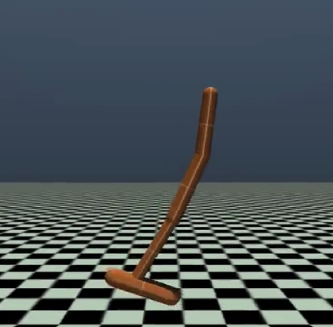
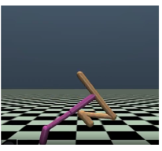
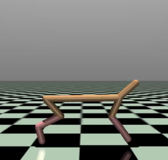

Reinforcement Learning Term Project

Solved the MuJoCo environments.
### Hopper

### Walker

### Half_Cheetah

Solved all the environments with TD3 Algorithm
TD3 does Twin & Double learning.
Twin Learning --> Double Q learning addresses the maximization bias
Delayed Learning --> Actor is less frequently updated than Critic.

Therefore, TD3 was much more stable than DDPG.

You can See the action videos and reward graphs.
